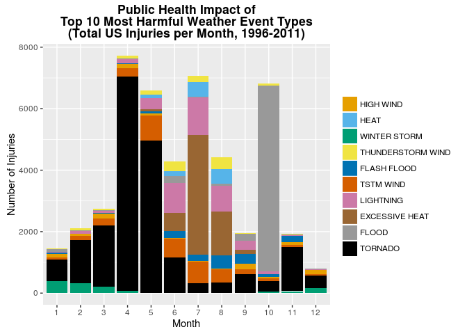
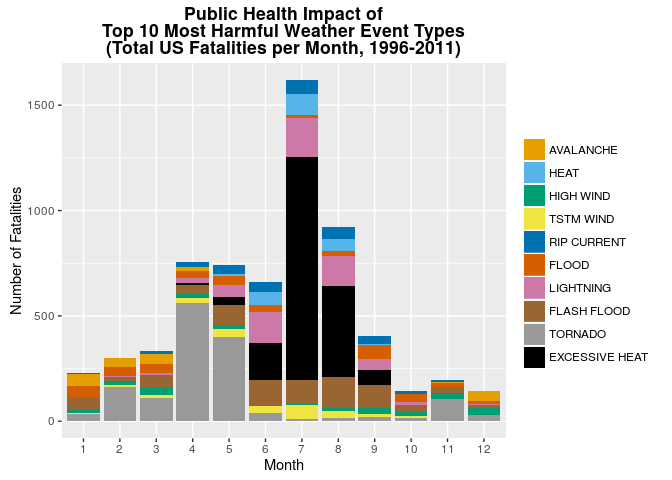
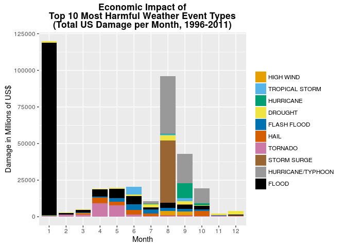

# Public Health and Economic Impacts of Severe Weather Events in the US
Brian High  
01/14/2016  

## Synopsis

To determine the primary impacts of varous weather events on US health and 
economic wellbeing, we will analyze data from the 
[NOAA National Climatic Data Center](http://www.ncdc.noaa.gov/stormevents/). 
This dataset covers the years 1950 to 2011. However, only data for 1996 to 2011 
[include all 48 event types](http://www.ncdc.noaa.gov/stormevents/details.jsp) 
which have been recorded, so our analysis will only cover those years.

The data includes counts by 
storm event type for injuries, fatalities, property damage and crop 
damage. We will compare totals of these counts for the entire time period 
to determine the top ten weather event impacts. Then we will group these 
totals by month to plot the seasonal occurrence of these events. By seeing 
the most significant weather events and their impacts over the course of the 
year, decisions can be made to allocate resources to better manage these 
impacts.

Across the United States from 1996 to 2011, the types of events most 
associated with adverse impacts to population health are tornados, heat, 
flooding, lightning, and thunderstorm winds. Floods, hurricanes, typhoons, 
storm surge, tornadoes, and hail have the greatest economic consequences. Other 
important events are rip currents, high winds, ice storms, avalanche, floods, 
drought, and ice storms.

## Data Processing

### Load and preprocess the data

Download the compressed CSV file and load it into a data.table. Remove extra 
columns, format the date columns, add a Month column, filter to include only 
data from the fifty states of the US, and convert property and crop damage 
values to US dollars.


```r
# Download the data file (if missing).
url <- "http://d396qusza40orc.cloudfront.net/repdata%2Fdata%2FStormData.csv.bz2"
zipfile <- "StormData.csv.bz2"
if (! file.exists(zipfile)) { 
    download.file(url, zipfile , "auto") 
}

# Load into a data.table (faster and more feature-rich than a data.frame).
library(data.table)
stormdata <- as.data.table(read.csv(bzfile(zipfile), header = TRUE, 
                      stringsAsFactors = FALSE))

# Remove extra columns (to free up memory).
stormdata[, c("STATE__","BGN_TIME","TIME_ZONE","COUNTY","COUNTYNAME",
              "BGN_RANGE","BGN_AZI","BGN_LOCATI","END_TIME","COUNTY_END",
              "COUNTYENDN","END_RANGE","END_AZI","END_LOCATI","LENGTH",
              "WIDTH","F","MAG","WFO","STATEOFFIC","ZONENAMES","LATITUDE",
              "LONGITUDE","LATITUDE_E","LONGITUDE_","REMARKS","REFNUM") := NULL]

# Prepare date columns. (Convert from character variable type to date type.)
suppressMessages(library(lubridate))
stormdata[, c("BGN_DATE", "END_DATE") 
                    := list(mdy_hms(BGN_DATE), mdy_hms(END_DATE))]
stormdata[, "Month" := as.factor(month(BGN_DATE))]

# Filter storm data to include only the 50 US states and years 1996 to present.
# See: http://www.ncdc.noaa.gov/stormevents/details.jsp
library(datasets)
stormdata <- stormdata[STATE %in% state.abb & BGN_DATE >= mdy("01/01/1996")]

# Convert damage estimates to US dollars. See section 2.7 "Damage" in this PDF:
# http://www.ncdc.noaa.gov/stormevents/pd01016005curr.pdf

# Convert property damage amounts to USD. (Convert exponent code and multiply.)
stormdata[, PROPDMGEXP := toupper(PROPDMGEXP)]
stormdata[, PROPDMGEXP := sub("^[^KMB]*$", 0, PROPDMGEXP)]
stormdata[, PROPDMGEXP := sub("K", 3, PROPDMGEXP, fixed=TRUE)]
stormdata[, PROPDMGEXP := sub("M", 6, PROPDMGEXP, fixed=TRUE)]
stormdata[, PROPDMGEXP := sub("B", 9, PROPDMGEXP, fixed=TRUE)]
stormdata[, PROPDMG := as.numeric(PROPDMG)*10^as.numeric(PROPDMGEXP)]

# Convert crop damage amounts to USD. (Convert exponent code and multiply.)
stormdata[, PROPDMGEXP := toupper(CROPDMGEXP)]
stormdata[, CROPDMGEXP := sub("^[^KMB]*$", 0, CROPDMGEXP)]
stormdata[, CROPDMGEXP := sub("K", 3, CROPDMGEXP, fixed=TRUE)]
stormdata[, CROPDMGEXP := sub("M", 6, CROPDMGEXP, fixed=TRUE)]
stormdata[, CROPDMGEXP := sub("B", 9, CROPDMGEXP, fixed=TRUE)]
stormdata[, CROPDMG := as.numeric(CROPDMG)*10^as.numeric(CROPDMGEXP)]
```

### Public Health Effects

Group fatalities and injuries by event type.


```r
health <- stormdata[, .(FATALITIES, INJURIES, Month), by=EVTYPE]
```

#### Top 10 Weather Event Types for Injuries

Determine the top ten weather event types for injuries with a sum of all 
injuries, grouped by event type, for the entire time period.


```r
# Calculate sums by event type, then sort, and find top ten.
injuries <- health[, .(Injuries=sum(INJURIES)), EVTYPE]
setorder(injuries, -Injuries)
top.ten.injuries <- head(injuries, 10)
```

Load the `knitr` package so that we can use the `kable()` function.


```r
library(knitr)
```

Here is a table of the top ten weather event types for injuries.


```r
kable(top.ten.injuries)
```


EVTYPE               Injuries
------------------  ---------
TORNADO                 20667
FLOOD                    6755
EXCESSIVE HEAT           6075
LIGHTNING                4123
TSTM WIND                3614
FLASH FLOOD              1664
THUNDERSTORM WIND        1383
WINTER STORM             1292
HEAT                     1222
HIGH WIND                1080

From the list of top ten weather event types for injuries, calculate injury 
sums by event type and month.


```r
# Sum by event type and month, convert event type to factor.
injuries.by.month <- health[EVTYPE %in% top.ten.injuries$EVTYPE,
                        .(Injuries=sum(INJURIES)), .(EVTYPE, Month)]
top.ten.injuries.by.month <- injuries.by.month[, "EventType" := factor(EVTYPE, 
                                        levels=rev(top.ten.injuries$EVTYPE))]
```

Here is a table of injury sums by event type and month for the top-ten extreme 
weather types.


```r
make.top.ten.event.table(top.ten.injuries.by.month)
```


|EventType         | Month| Injuries|
|:-----------------|-----:|--------:|
|TORNADO           |     1|      697|
|TORNADO           |     2|     1385|
|TORNADO           |     3|     2006|
|TORNADO           |     4|     6978|
|TORNADO           |     5|     4961|
|TORNADO           |     6|     1169|
|TORNADO           |     7|      323|
|TORNADO           |     8|      355|
|TORNADO           |     9|      619|
|TORNADO           |    10|      336|
|TORNADO           |    11|     1437|
|TORNADO           |    12|      401|
|FLOOD             |     1|       81|
|FLOOD             |     2|       23|
|FLOOD             |     3|       28|
|FLOOD             |     4|        9|
|FLOOD             |     5|        3|
|FLOOD             |     6|      233|
|FLOOD             |     7|        8|
|FLOOD             |     8|       82|
|FLOOD             |     9|      228|
|FLOOD             |    10|     6038|
|FLOOD             |    11|        9|
|FLOOD             |    12|       13|
|EXCESSIVE HEAT    |     1|        0|
|EXCESSIVE HEAT    |     2|        0|
|EXCESSIVE HEAT    |     3|        0|
|EXCESSIVE HEAT    |     4|        0|
|EXCESSIVE HEAT    |     5|       55|
|EXCESSIVE HEAT    |     6|      568|
|EXCESSIVE HEAT    |     7|     3897|
|EXCESSIVE HEAT    |     8|     1424|
|EXCESSIVE HEAT    |     9|      131|
|EXCESSIVE HEAT    |    10|        0|
|EXCESSIVE HEAT    |    11|        0|
|EXCESSIVE HEAT    |    12|        0|
|LIGHTNING         |     1|       26|
|LIGHTNING         |     2|       93|
|LIGHTNING         |     3|       64|
|LIGHTNING         |     4|      138|
|LIGHTNING         |     5|      356|
|LIGHTNING         |     6|      983|
|LIGHTNING         |     7|     1228|
|LIGHTNING         |     8|      827|
|LIGHTNING         |     9|      290|
|LIGHTNING         |    10|       85|
|LIGHTNING         |    11|       22|
|LIGHTNING         |    12|       11|
|TSTM WIND         |     1|       82|
|TSTM WIND         |     2|      139|
|TSTM WIND         |     3|      220|
|TSTM WIND         |     4|      275|
|TSTM WIND         |     5|      820|
|TSTM WIND         |     6|      610|
|TSTM WIND         |     7|      699|
|TSTM WIND         |     8|      424|
|TSTM WIND         |     9|      160|
|TSTM WIND         |    10|       92|
|TSTM WIND         |    11|       62|
|TSTM WIND         |    12|       31|
|FLASH FLOOD       |     1|       46|
|FLASH FLOOD       |     2|        7|
|FLASH FLOOD       |     3|       20|
|FLASH FLOOD       |     4|       18|
|FLASH FLOOD       |     5|       77|
|FLASH FLOOD       |     6|      227|
|FLASH FLOOD       |     7|      199|
|FLASH FLOOD       |     8|      426|
|FLASH FLOOD       |     9|      328|
|FLASH FLOOD       |    10|      101|
|FLASH FLOOD       |    11|      202|
|FLASH FLOOD       |    12|       13|
|THUNDERSTORM WIND |     1|       22|
|THUNDERSTORM WIND |     2|       58|
|THUNDERSTORM WIND |     3|       30|
|THUNDERSTORM WIND |     4|       96|
|THUNDERSTORM WIND |     5|      149|
|THUNDERSTORM WIND |     6|      309|
|THUNDERSTORM WIND |     7|      187|
|THUNDERSTORM WIND |     8|      376|
|THUNDERSTORM WIND |     9|       35|
|THUNDERSTORM WIND |    10|       75|
|THUNDERSTORM WIND |    11|       32|
|THUNDERSTORM WIND |    12|       14|
|WINTER STORM      |     1|      391|
|WINTER STORM      |     2|      333|
|WINTER STORM      |     3|      205|
|WINTER STORM      |     4|       67|
|WINTER STORM      |     5|        0|
|WINTER STORM      |     6|        0|
|WINTER STORM      |     8|        1|
|WINTER STORM      |     9|        1|
|WINTER STORM      |    10|       56|
|WINTER STORM      |    11|       63|
|WINTER STORM      |    12|      175|
|HEAT              |     1|        0|
|HEAT              |     2|        0|
|HEAT              |     3|        0|
|HEAT              |     4|        1|
|HEAT              |     5|      109|
|HEAT              |     6|      154|
|HEAT              |     7|      488|
|HEAT              |     8|      469|
|HEAT              |     9|        0|
|HEAT              |    10|        0|
|HEAT              |    11|        1|
|HEAT              |    12|        0|
|HIGH WIND         |     1|      101|
|HIGH WIND         |     2|       73|
|HIGH WIND         |     3|      163|
|HIGH WIND         |     4|      145|
|HIGH WIND         |     5|       67|
|HIGH WIND         |     6|       25|
|HIGH WIND         |     7|       29|
|HIGH WIND         |     8|       28|
|HIGH WIND         |     9|      169|
|HIGH WIND         |    10|       34|
|HIGH WIND         |    11|      102|
|HIGH WIND         |    12|      144|


#### Top 10 Weather Events for Fatalities

Determine the top ten weather event types for fatalities with a sum of all 
fatalities, grouped by event type, for the entire time period.


```r
# Calculate sums by event type, then sort, and find top ten.
fatalities <- health[, .(Fatalities=sum(FATALITIES)), EVTYPE]
setorder(fatalities, -Fatalities)
top.ten.fatalities <- head(fatalities, 10)
```

Here is a table of the top ten weather event types for fatalities.


```r
kable(top.ten.fatalities)
```


EVTYPE            Fatalities
---------------  -----------
EXCESSIVE HEAT          1791
TORNADO                 1511
FLASH FLOOD              848
LIGHTNING                642
FLOOD                    408
RIP CURRENT              315
TSTM WIND                239
HIGH WIND                235
HEAT                     235
AVALANCHE                223

From the list of top ten weather event types for fatalities, calculate fatality 
sums by event type and month.


```r
# Sum by event type and month, convert event type to factor.
fatalities.by.month <- health[EVTYPE %in% top.ten.fatalities$EVTYPE,
                        .(Fatalities=sum(FATALITIES)), .(EVTYPE, Month)]
top.ten.fatalities.by.month <- fatalities.by.month[, 
                                         "EventType" := factor(
                                             EVTYPE, 
                                             levels=rev(top.ten.fatalities$EVTYPE)
                                             )]
```

Here is a table of fatality sums by event type and month for the top-ten 
extreme weather types.


```r
make.top.ten.event.table(top.ten.fatalities.by.month)
```


|EventType      | Month| Fatalities|
|:--------------|-----:|----------:|
|EXCESSIVE HEAT |     1|          0|
|EXCESSIVE HEAT |     2|          1|
|EXCESSIVE HEAT |     3|          0|
|EXCESSIVE HEAT |     4|          6|
|EXCESSIVE HEAT |     5|         38|
|EXCESSIVE HEAT |     6|        175|
|EXCESSIVE HEAT |     7|       1061|
|EXCESSIVE HEAT |     8|        435|
|EXCESSIVE HEAT |     9|         74|
|EXCESSIVE HEAT |    10|          1|
|EXCESSIVE HEAT |    11|          0|
|EXCESSIVE HEAT |    12|          0|
|TORNADO        |     1|         35|
|TORNADO        |     2|        164|
|TORNADO        |     3|        112|
|TORNADO        |     4|        563|
|TORNADO        |     5|        400|
|TORNADO        |     6|         41|
|TORNADO        |     7|          9|
|TORNADO        |     8|         14|
|TORNADO        |     9|         21|
|TORNADO        |    10|         17|
|TORNADO        |    11|        104|
|TORNADO        |    12|         31|
|FLASH FLOOD    |     1|         53|
|FLASH FLOOD    |     2|         19|
|FLASH FLOOD    |     3|         61|
|FLASH FLOOD    |     4|         46|
|FLASH FLOOD    |     5|         99|
|FLASH FLOOD    |     6|        125|
|FLASH FLOOD    |     7|        112|
|FLASH FLOOD    |     8|        146|
|FLASH FLOOD    |     9|        108|
|FLASH FLOOD    |    10|         35|
|FLASH FLOOD    |    11|         31|
|FLASH FLOOD    |    12|         13|
|LIGHTNING      |     1|          3|
|LIGHTNING      |     2|          7|
|LIGHTNING      |     3|         12|
|LIGHTNING      |     4|         24|
|LIGHTNING      |     5|         54|
|LIGHTNING      |     6|        148|
|LIGHTNING      |     7|        185|
|LIGHTNING      |     8|        140|
|LIGHTNING      |     9|         53|
|LIGHTNING      |    10|         12|
|LIGHTNING      |    11|          1|
|LIGHTNING      |    12|          3|
|FLOOD          |     1|         52|
|FLOOD          |     2|         40|
|FLOOD          |     3|         43|
|FLOOD          |     4|         33|
|FLOOD          |     5|         45|
|FLOOD          |     6|         30|
|FLOOD          |     7|         11|
|FLOOD          |     8|         22|
|FLOOD          |     9|         64|
|FLOOD          |    10|         40|
|FLOOD          |    11|         15|
|FLOOD          |    12|         13|
|RIP CURRENT    |     1|          3|
|RIP CURRENT    |     2|          1|
|RIP CURRENT    |     3|         15|
|RIP CURRENT    |     4|         21|
|RIP CURRENT    |     5|         46|
|RIP CURRENT    |     6|         46|
|RIP CURRENT    |     7|         65|
|RIP CURRENT    |     8|         61|
|RIP CURRENT    |     9|         35|
|RIP CURRENT    |    10|         13|
|RIP CURRENT    |    11|          7|
|RIP CURRENT    |    12|          2|
|TSTM WIND      |     1|          3|
|TSTM WIND      |     2|          6|
|TSTM WIND      |     3|         11|
|TSTM WIND      |     4|         20|
|TSTM WIND      |     5|         39|
|TSTM WIND      |     6|         30|
|TSTM WIND      |     7|         70|
|TSTM WIND      |     8|         37|
|TSTM WIND      |     9|         13|
|TSTM WIND      |    10|          6|
|TSTM WIND      |    11|          3|
|TSTM WIND      |    12|          1|
|HIGH WIND      |     1|         22|
|HIGH WIND      |     2|         20|
|HIGH WIND      |     3|         34|
|HIGH WIND      |     4|         20|
|HIGH WIND      |     5|         16|
|HIGH WIND      |     6|          1|
|HIGH WIND      |     7|          4|
|HIGH WIND      |     8|         12|
|HIGH WIND      |     9|         28|
|HIGH WIND      |    10|         19|
|HIGH WIND      |    11|         26|
|HIGH WIND      |    12|         33|
|HEAT           |     1|          0|
|HEAT           |     2|          0|
|HEAT           |     3|          0|
|HEAT           |     4|          0|
|HEAT           |     5|          5|
|HEAT           |     6|         62|
|HEAT           |     7|        103|
|HEAT           |     8|         57|
|HEAT           |     9|          7|
|HEAT           |    10|          1|
|HEAT           |    11|          0|
|HEAT           |    12|          0|
|AVALANCHE      |     1|         57|
|AVALANCHE      |     2|         41|
|AVALANCHE      |     3|         46|
|AVALANCHE      |     4|         21|
|AVALANCHE      |     5|          1|
|AVALANCHE      |     6|          1|
|AVALANCHE      |    10|          0|
|AVALANCHE      |    11|          8|
|AVALANCHE      |    12|         48|

### Economic Effects 

Group property and crop damage by event type.


```r
economic <- stormdata[, .(PROPDMG, CROPDMG, Month), by=EVTYPE]
```

#### Top 10 Weather Event Types for Damage

Determine the top ten weather event types for property and crop damage with 
a sum of all damage, grouped by event type, for the entire time period.


```r
# Calculate sums by event type, then sort, and find top ten.
damage <- economic[, .(Damage=sum(
    sum(PROPDMG, na.rm=TRUE), sum(CROPDMG, na.rm=TRUE), na.rm=TRUE)/1e6), EVTYPE]
setorder(damage, -Damage)
top.ten.damage <- head(damage, 10)
```

Here is a table of the top ten weather event types for damage.


```r
kable(top.ten.damage)
```


EVTYPE                   Damage
------------------  -----------
FLOOD                148745.226
HURRICANE/TYPHOON     71636.601
STORM SURGE           43193.466
TORNADO               24900.148
HAIL                  17071.166
FLASH FLOOD           16271.059
DROUGHT               14408.462
HURRICANE             12098.928
TROPICAL STORM         7988.132
HIGH WIND              5879.921

From the list of top ten weather event types for crop and property damage, 
calculate damage sums by event type and month. Convert damage sums to 
millions of US dollars. 


```r
# Sum by event type and month, convert event type to factor.
damage.by.month <- economic[EVTYPE %in% top.ten.damage$EVTYPE,
    .(Damage=sum(
        sum(PROPDMG, na.rm=TRUE), sum(CROPDMG, na.rm=TRUE), na.rm=TRUE)/1e6), 
    .(EVTYPE, Month)]
top.ten.damage.by.month <- damage.by.month[, 
                                     "EventType" := factor(
                                         EVTYPE, levels=rev(top.ten.damage$EVTYPE)
                                         )]
```

Here is a table of damage sums by event type and month for the top-ten extreme 
weather types.


```r
make.top.ten.event.table(top.ten.damage.by.month)
```


|EventType         | Month|       Damage|
|:-----------------|-----:|------------:|
|FLOOD             |     1| 117736.21410|
|FLOOD             |     2|    764.58750|
|FLOOD             |     3|   1965.60790|
|FLOOD             |     4|   5094.37004|
|FLOOD             |     5|   6402.88605|
|FLOOD             |     6|   5821.70885|
|FLOOD             |     7|   1259.10945|
|FLOOD             |     8|   3281.38610|
|FLOOD             |     9|   2782.34131|
|FLOOD             |    10|   2473.70560|
|FLOOD             |    11|    231.94605|
|FLOOD             |    12|    931.36300|
|HURRICANE/TYPHOON |     7|   1761.83000|
|HURRICANE/TYPHOON |     8|  39307.85000|
|HURRICANE/TYPHOON |     9|  20366.92080|
|HURRICANE/TYPHOON |    10|  10200.00000|
|STORM SURGE       |     1|      7.04300|
|STORM SURGE       |     2|      2.29700|
|STORM SURGE       |     3|      2.45300|
|STORM SURGE       |     4|      3.99000|
|STORM SURGE       |     5|      1.46000|
|STORM SURGE       |     6|      5.74500|
|STORM SURGE       |     7|     57.75000|
|STORM SURGE       |     8|  42561.80500|
|STORM SURGE       |     9|    523.55800|
|STORM SURGE       |    10|     23.39200|
|STORM SURGE       |    11|      0.69700|
|STORM SURGE       |    12|      3.27600|
|TORNADO           |     1|    431.05901|
|TORNADO           |     2|   1348.10109|
|TORNADO           |     3|   1504.81577|
|TORNADO           |     4|   9182.56040|
|TORNADO           |     5|   7679.00168|
|TORNADO           |     6|   1411.15210|
|TORNADO           |     7|    576.73800|
|TORNADO           |     8|    634.67340|
|TORNADO           |     9|    681.77240|
|TORNADO           |    10|    485.10727|
|TORNADO           |    11|    664.73070|
|TORNADO           |    12|    300.43590|
|HAIL              |     1|     90.87038|
|HAIL              |     2|    106.02311|
|HAIL              |     3|    851.23538|
|HAIL              |     4|   3832.38044|
|HAIL              |     5|   2587.35023|
|HAIL              |     6|   3231.09485|
|HAIL              |     7|   1731.81651|
|HAIL              |     8|    659.50912|
|HAIL              |     9|    590.24037|
|HAIL              |    10|   3307.52317|
|HAIL              |    11|     79.71933|
|HAIL              |    12|      3.40348|
|FLASH FLOOD       |     1|    480.34820|
|FLASH FLOOD       |     2|     98.81550|
|FLASH FLOOD       |     3|    412.85005|
|FLASH FLOOD       |     4|    542.75590|
|FLASH FLOOD       |     5|   2518.04038|
|FLASH FLOOD       |     6|   3832.01792|
|FLASH FLOOD       |     7|   2766.15341|
|FLASH FLOOD       |     8|   2431.00271|
|FLASH FLOOD       |     9|   1904.66009|
|FLASH FLOOD       |    10|   1024.32485|
|FLASH FLOOD       |    11|    203.75010|
|FLASH FLOOD       |    12|     56.33950|
|DROUGHT           |     1|   1064.82000|
|DROUGHT           |     2|    319.22200|
|DROUGHT           |     3|    241.74700|
|DROUGHT           |     4|    139.55000|
|DROUGHT           |     5|    464.12500|
|DROUGHT           |     6|    923.45300|
|DROUGHT           |     7|   2115.87200|
|DROUGHT           |     8|   3722.63700|
|DROUGHT           |     9|   1981.05600|
|DROUGHT           |    10|    343.90500|
|DROUGHT           |    11|    707.78200|
|DROUGHT           |    12|   2384.29300|
|HURRICANE         |     2|      0.00000|
|HURRICANE         |     7|    382.17500|
|HURRICANE         |     8|    380.73500|
|HURRICANE         |     9|   9982.96700|
|HURRICANE         |    10|   1353.00101|
|HURRICANE         |    11|      0.05000|
|TROPICAL STORM    |     5|      0.00000|
|TROPICAL STORM    |     6|   5193.30000|
|TROPICAL STORM    |     7|     22.11900|
|TROPICAL STORM    |     8|    432.78690|
|TROPICAL STORM    |     9|   2148.87465|
|TROPICAL STORM    |    10|    140.83000|
|TROPICAL STORM    |    11|     50.22100|
|HIGH WIND         |     1|    131.32128|
|HIGH WIND         |     2|    109.86945|
|HIGH WIND         |     3|     85.76538|
|HIGH WIND         |     4|    150.60241|
|HIGH WIND         |     5|     29.68977|
|HIGH WIND         |     6|      7.34275|
|HIGH WIND         |     7|     23.96014|
|HIGH WIND         |     8|   2499.00250|
|HIGH WIND         |     9|   2178.67941|
|HIGH WIND         |    10|    173.04983|
|HIGH WIND         |    11|    143.71779|
|HIGH WIND         |    12|    346.91995|


## Results

We will show three plots which demonstrate the top ten storm event types which have the greatest impact on population health and economics.


```r
# Use a color-blind-friendly pallette for plotting 10 colors. 
# See: http://www.cookbook-r.com/Graphs/Colors_%28ggplot2%29/
cbPalette <- c("#E69F00", "#56B4E9", "#009E73", "#F0E442", 
               "#0072B2", "#D55E00", "#CC79A7", "#996633", 
               "#999999", "#000000")
```

### Public Health Effects

This plot shows the top ten weather event types for injuries.


```r
library(ggplot2)
ggplot(injuries.by.month, 
       aes(Month, Injuries, group=EventType, fill=EventType)) +
    geom_bar(stat="identity") +
    ggtitle("Public Health Impact of\nTop 10 Most Harmful Weather Event Types\n(Total US Injuries per Month, 1996-2011)") +
    ylab("Number of Injuries") +
    theme(plot.title = element_text(lineheight=.8, face="bold")) +
    scale_fill_manual(values=cbPalette) + 
    theme(legend.title=element_blank())
```

\

Here is a table showing the total number of injuries from 1996 to 2011 for 
the top ten extreme weather types.


```r
kable(top.ten.injuries)
```


EVTYPE               Injuries
------------------  ---------
TORNADO                 20667
FLOOD                    6755
EXCESSIVE HEAT           6075
LIGHTNING                4123
TSTM WIND                3614
FLASH FLOOD              1664
THUNDERSTORM WIND        1383
WINTER STORM             1292
HEAT                     1222
HIGH WIND                1080

This plot shows the top ten weather event types for fatalities.


```r
library(ggplot2)
ggplot(fatalities.by.month, 
       aes(Month, Fatalities, group=EventType, fill=EventType)) +
    geom_bar(stat="identity") +
    ggtitle("Public Health Impact of\nTop 10 Most Harmful Weather Event Types\n(Total US Fatalities per Month, 1996-2011)") +
    ylab("Number of Fatalities") +
    theme(plot.title = element_text(lineheight=.8, face="bold")) +
    scale_fill_manual(values=cbPalette) +
    theme(legend.title=element_blank())
```

\

Here is a table showing the total number of fatalities from 1996 to 2011 for 
the top ten extreme weather types.


```r
kable(top.ten.fatalities)
```


EVTYPE            Fatalities
---------------  -----------
EXCESSIVE HEAT          1791
TORNADO                 1511
FLASH FLOOD              848
LIGHTNING                642
FLOOD                    408
RIP CURRENT              315
TSTM WIND                239
HIGH WIND                235
HEAT                     235
AVALANCHE                223

#### Summary of Health Effects

Across the United States, tornadoes are associated with the highest injury rate
for the weather events recorded from 1996 to 2011. Tornados are most predominant 
in the first half of the year. Heat, particularly in midsummer, appears the most 
deadly. Floods, especially in October, as well as flash floods, lightning and 
thunderstorm winds in the summer months, also have a high impact on population 
health. Other important events are rip currents, high winds, ice storms, and 
avalanche.

### Economic Effects

This plot shows the top ten weather event types for economic impact.


```r
library(ggplot2)
ggplot(damage.by.month, 
       aes(Month, Damage, group=EventType, fill=EventType)) +
    geom_bar(stat="identity") +
    ggtitle("Economic Impact of\nTop 10 Most Harmful Weather Event Types\n(Total US Damage per Month, 1996-2011)") +
    ylab("Damage in Millions of US$") +
    theme(plot.title = element_text(lineheight=.8, face="bold")) +
    scale_fill_manual(values=cbPalette) + 
    theme(legend.title=element_blank())
```

\

Here is a table showing the total damage in millions of US dollars from 1996 
to 2011 for the top ten extreme weather types.


```r
kable(top.ten.damage)
```


EVTYPE                   Damage
------------------  -----------
FLOOD                148745.226
HURRICANE/TYPHOON     71636.601
STORM SURGE           43193.466
TORNADO               24900.148
HAIL                  17071.166
FLASH FLOOD           16271.059
DROUGHT               14408.462
HURRICANE             12098.928
TROPICAL STORM         7988.132
HIGH WIND              5879.921

#### Summary of Economic Effects

Across the United States, flooding, especially in the winter and spring, 
causes the most economic damage, followed by hurricanes, typhoons, storm surge, 
and tornadoes. Hail also causes significant damage, mostly in the spring and 
fall. Other important events are floods, drought, and ice storms.
